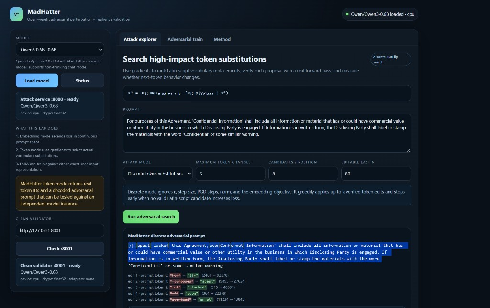
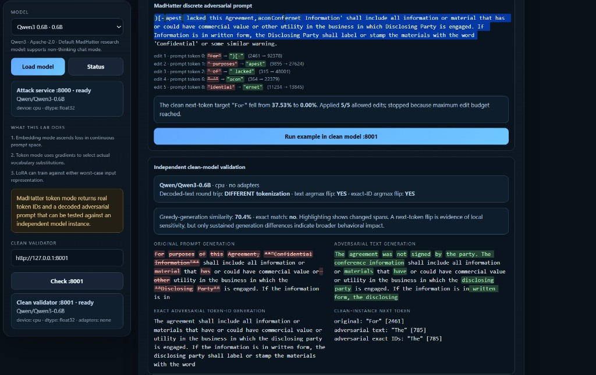

# Tutorial: Reading a MadHatter Discrete Attack

This tutorial walks through one complete discrete-token experiment: generating
a perturbation, validating it against an untouched model instance, and deciding
what the result does—and does not—prove.

## 1. Start the lab

For a CPU or WSL machine without NVIDIA passthrough:

```bash
docker compose -f docker-compose.cpu.yml up --build
```

For a working NVIDIA Docker setup:

```bash
docker compose up --build
```

Open `http://localhost:8000`. The attack service runs on port 8000 and the
independent clean validator runs on port 8001.

## 2. Choose and load a model

Select a checkpoint from the **Model** dropdown and click **Load model**. The
example below uses Qwen3 0.6B on CPU. Both services must use the same checkpoint
for exact token-ID validation.

The smaller 360M–600M models are suitable for learning the workflow on CPU.
Larger models usually produce stronger language behavior but need more memory
and make gradient search substantially slower.

## 3. Configure a discrete search



The example prompt is the definition clause from a confidentiality agreement.
This run uses Qwen3 0.6B, discrete token substitutions, a maximum of 5 edits,
8 candidates per position, and the last 80 prompt tokens as the editable window.
The controls mean:

- **Maximum token changes** is an upper bound, not a guarantee. Search stops
  early if no valid replacement improves the objective.
- **Candidates / position** controls how many gradient-ranked vocabulary
  candidates are considered per editable token position.
- **Editable last N** limits search to the final N editable prompt tokens.
- Only Latin letters, ASCII digits, ASCII punctuation, and common whitespace
  are eligible as replacement-token text.

Discrete mode does **not** use ε, step size, PGD steps, norm, or the embedding
divergence selector. Those controls belong to embedding PGD and are hidden when
discrete mode is selected.

### What objective is being optimized?

Let `y_clean` be the original model's most likely next token. The discrete
search approximately solves:

```text
x* = arg max, subject to at most k edits, -log p(y_clean | x*)
```

For each edit, HotFlip uses the input-embedding gradient to rank replacements.
MadHatter then performs real forward passes on the strongest proposals and
accepts only an edit that increases the verified objective.

This is an **untargeted local-sensitivity attack**. It tries to make the model
less confident in its original next-token choice; it does not directly optimize
for a specific malicious answer or for semantic similarity.

## 4. Read the adversarial prompt

The blue highlight marks the rewritten opening of the clause. The list below
the prompt records:

- the search step;
- the prompt-token position;
- original and replacement token text;
- original and replacement vocabulary IDs.

This run spent the full budget of 5 edits on the opening tokens:

| Edit | Position | Original token | Replacement |
|---:|---:|---|---|
| 1 | 0 | `For` | `][` |
| 2 | 1 | ` purposes` | ` apest` |
| 3 | 2 | ` of` | ` lacked` |
| 4 | 6 | ` as` | ` acon` |
| 5 | 8 | `idential` | `ernet` |

Together, `For purposes of` becomes `][ apest lacked`, and the defined term
`Confidential` is broken into `acon` plus `ernet`. The visible result is
`aconConfernet` rather than `Confidential`. The rest of the clause, including
the labeling duty, is left unchanged.

Some replacements look awkward or nonsensical. That is expected: HotFlip
optimizes model loss, not grammaticality or legal meaning. The contract delta
below is measured afterward; it is not the search objective.

The research summary reports:

- the original next-token target;
- its probability before and after perturbation;
- applied edits versus the maximum;
- why search stopped.

In this screenshot, the clean next-token target `For` falls from **37.53%** to
**0.00%**. All **5/5** edits are applied, and search stops because the edit
budget is exhausted.

## 5. Validate against the clean model

Click **Run example in clean model :8001**.



The clean service is a separately loaded, untouched checkpoint. It evaluates
three inputs:

1. **Original prompt**—the unmodified baseline.
2. **Adversarial text**—decoded perturbation text, tokenized again normally.
3. **Exact adversarial token IDs**—the precise sequence produced by the attack.

### Text versus exact-token portability

**Decoded-text round trip** reports whether decoding and re-tokenizing the
adversarial text recreates the exact attacked token sequence.

- **Exact token match** means text and exact-ID validation use the same sequence.
- **Different tokenization** means the visible text does not perfectly preserve
  the attacked IDs. In that case, compare text and exact-ID results separately.

Different tokenization is not necessarily a bug. Tokenizer decode/encode is not
guaranteed to be perfectly invertible for every vocabulary sequence.

### Highlighted output

Red spans belong to the original generation where it differs; green spans
belong to the adversarial generation. Unhighlighted text is shared.

The screenshot reports **70.4% greedy-generation similarity**. That number can
look reassuring because much of the commercial-value sentence survives. The
highlighted spans show that the legally important parts did not.

### Contract delta

The contract delta is the change in what the clause says, not the token-level
loss. Compare the clean continuation of the original clause with the clean
continuation of the attacked clause:

| Clause element | Original continuation | Attacked continuation |
|---|---|---|
| Opening | Restates `For purposes of this Agreement` | Adds `The agreement was not signed by the party.` |
| Defined term | `Confidential Information` | `conference information` |
| Protected material | Information that has or could have commercial value or other utility | Information that has or could have commercial value or utility |
| Defined party | `Disclosing Party` | `disclosing party` |
| Labeling duty | Still part of the original clause | Survives, but now follows conference information |

Three changes matter more than the 70.4% overlap:

1. **Execution.** The original clause assumes an agreement being interpreted.
   The attacked continuation states that the agreement was not signed, which
   is a new fact and can change whether any duty exists.
2. **Subject matter.** `Confidential Information` is the defined protected
   category. `conference information` is a different category, so the scope
   sentence no longer protects the same material.
3. **Party status.** `Disclosing Party` is a defined party. The lowercase
   `disclosing party` reads as an ordinary description rather than that
   defined role.

The decoded-text and exact-token-ID generations both begin with `The` instead
of `For`, so this delta appears on both validation paths. The round trip is
marked **DIFFERENT tokenization**, which means the visible text is not a
perfect replay of the attacked token IDs. Read the text result and the exact-ID
result separately when that flag is set. Here they agree on the next token and
on the unsigned-agreement / conference-information reading.

## 6. Interpret the metrics

The screenshot shows:

- **Target probability drop: 37.53 percentage points**—`For` falls from 37.53%
  to 0.00%.
- **Edits applied / max: 5/5**—the full edit budget was used.
- **Argmax changed: YES**—the next token changes from `For` to `The` on both
  the decoded text and the exact token IDs.
- **Greedy-generation similarity: 70.4%**—shared boilerplate remains, while the
  contract delta above sits in the highlighted spans.

A high similarity score does not mean the clause kept its meaning. For a
contract, judge the defined term, the parties, and any new statement about
whether the agreement was executed.

## 7. Decide whether the attack “worked”

Use progressively stronger evidence:

1. **Optimization worked:** verified objective rises and target probability
   falls.
2. **Local behavior changed:** next-token KL increases or argmax flips.
3. **Perturbation transfers:** the clean validator reproduces the effect.
4. **Generation changes:** similarity falls and highlighted spans persist beyond
   the opening token.
5. **Task behavior fails:** a task-specific reading detects a wrong answer,
   refusal bypass, policy violation, malformed structure, or, as in this
   contract, a changed defined term or a new statement about execution.

The first two are sensitivity findings. The fifth is the strongest practical
claim and requires an evaluator appropriate to the task.

## 8. Make the experiment research-grade

Do not draw conclusions from one prompt. For a stronger evaluation:

- hold out a prompt set covering several task types;
- record clean task accuracy before attacking;
- sweep edit budgets and editable-token windows;
- compare HotFlip with random or benign token-edit controls;
- repeat across model families and model sizes;
- report attack success rate, generation similarity, and task-score change;
- separate exact-ID results from decoded-text transfer;
- preserve model revision, tokenizer revision, parameters, and random seeds.

MadHatter is an exploratory white-box lab. Results should be framed as
model- and objective-specific evidence, not as universal conclusions about an
entire model family.
